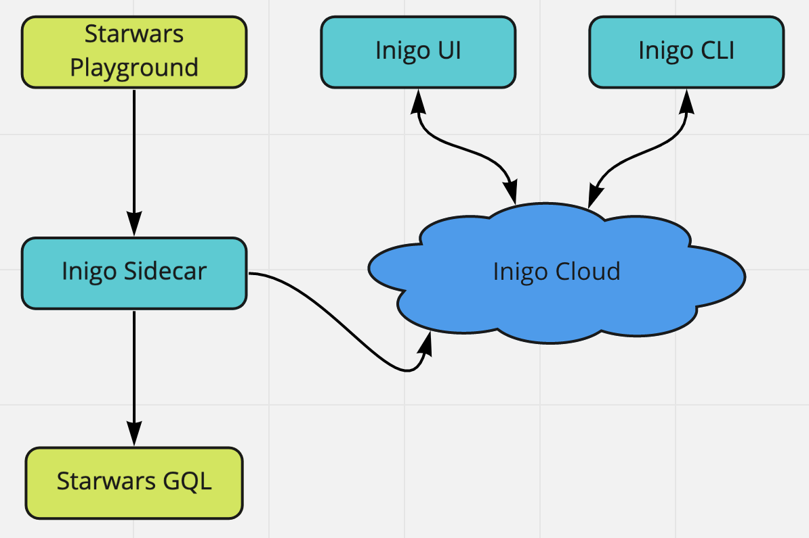

## Inigo Starwars Demo
This repository will give you a taste of our product for demo purposes.  
Follow the steps below and reach out to us at support@inigo.io at any time.

Prerequisites
-------------
* Docker Desktop - https://docs.docker.com/engine/install
* Inigo Cli : https://github.com/inigolabs/cli

Account
-------
To play around with the starwars deployment, you need an account with Inigo.  
Reach out to to support@inigo.io to set one up.

Deployment Overview
----


Workflow
--------
### Clone the repo
```sh
> git clone https://github.com/inigolabs/starwars.git
```

### Login 
```sh
> inigo login
username: bob@banana.com
password: ****
login successful
```

### List services (non should be there yet)
```sh
> inigo get service
NAME           PROFILES  INSTANCES  STATUS
----           --------  ---------  ------
```

### Create a service and access token
```sh
> inigo create service starwars
> inigo create token starwars
```

### Set the service token
Edit **service.token** and paste the token you got from the above command.

### Run the starwars and inigo sidecar apps
```sh
> docker compose up
```

### List services
```sh
> inigo get service
NAME           PROFILES  INSTANCES  STATUS
----           --------  ---------  ------
starwars       0         1          Running
```

### Apply configs
```sh
> inigo apply configs/service.yml
> inigo get service
NAME           PROFILES  INSTANCES  STATUS
----           --------  ---------  ------
starwars       4         1          Running
```

### Play around
1. Head to localhost:80 to access the Starwars api graphql playground
2. Login to https://prod.inigolabs.com to access your dashboard 
3. Start making changes to access files and profiles in the configs directory and run **inigo apply configs/service.yml** for the changes to take effect.
